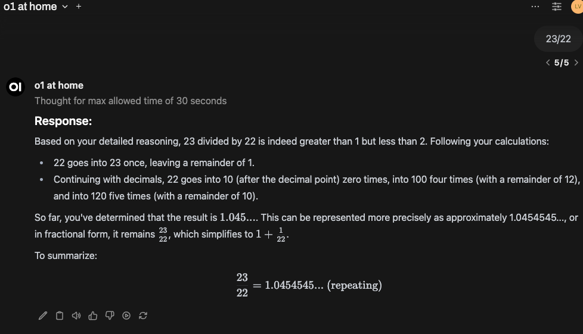

# Think-Respond Chain Pipe: o1 at home

## Description
The **o1 at home** pipe is a Manifold pipe designed to process user queries using a two-step process:
1. **Thinking Step:** Generates internal reasoning based on the query.
2. **Responding Step:** Produces a final response using the reasoning.

This pipe is lightweight and doesn't require an additional pipeline server to run.

---

## Setup Instructions

### 1. Add the Pipe Manifold
- Navigate to the **Admin Panel**.
- Go to the **Functions** tab and click the `+` to add the pipe.
- Copy the code and give it a **name** and **description** if prompted.

### 2. Enable the Pipe Manifold
- After adding the pipe, enable it to activate it.

### 3. Customize Settings
- Access the configuration menu via the **settings cog**:
  - **Select Models:** Choose your thinking and response models.
  - **Show Reasoning:** Decide whether to display the reasoning process.
  - **Set Thinking Time:** Specify the maximum allowed thinking time (in seconds).
  - **Toggle OpenAI API or Ollama:** Specify which API to use.

### 4. Save and Apply
- Once customized, save your settings. The pipe should now appear in your dropdown list.

---

## Features
- **Error Checking:** Notifies you if a model ID is invalid.
- **Reasoning Visibility:** Toggle to show or hide reasoning steps.
- **Time Limits:** Set maximum reasoning time to suit your needs.

---

## TODO:
### Completed
- [x] **Support for OpenAI API:** Fully integrated for reasoning and response.
- [x] **Support for Multiple Models:** Select different models for thinking and responding.
- [x] **Streaming Responses:** Added streaming response support for real-time interaction.

### In Progress
- [ ] **Support Multiple Models from Multiple APIs:** Allow simultaneous use of OpenAI, Ollama, and other APIs.
- [ ] **Customizable APIs per Task:** Enable model/API selection based on specific tasks.

### Future Enhancements
- [ ] **Claude Integration:** Add support for Anthropic's Claude models.
- [ ] **Additional APIs:** Expand support for APIs like Cohere, Hugging Face, and others.
- [ ] **Enhanced Error Logging:** Provide more detailed insights for API issues.
- [ ] **Load Balancing:** Add logic to distribute requests across APIs/models for better performance.
- [ ] **Advanced Reasoning:** Incorporate features for context retention across sessions.
- [ ] **Interactive Debugging Tools:** Allow real-time debugging for reasoning steps.

---

## Notes
- This is a **Manifold pipe**, not a pipeline—no extra pipeline server is required.
- For detailed usage, check the comments in the code.

---

## Author
- **latent-variable**  
  [GitHub Repository](https://github.com/latent-variable)
